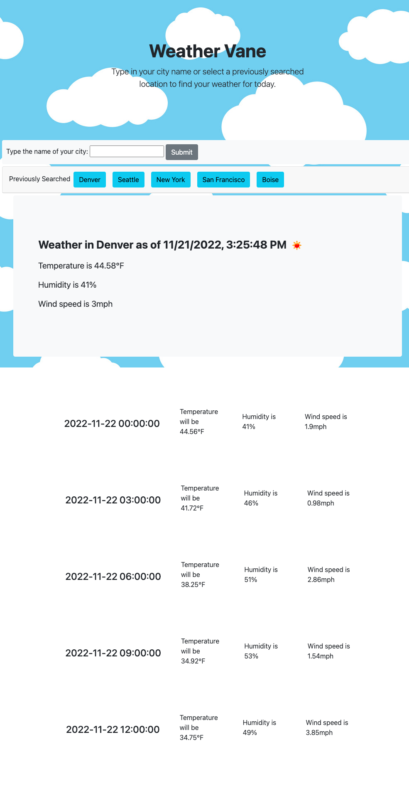

# weather-app
Coding Bootcamp Challenge #6 - Server Side APIs

## Description

This project used server-side APIs to create a web based weather app while also using our knowledge of JavaScript and local storage. This app includes: 

- Use of the Open Weather API to fetch current and five-day forecasts. 
- Locally stored search items that will render on the page after refresh.  
- Dynamically added elements and event listeners. 

This project challenging but fun. There were a couple of sticky spots for me (namely the five-day forecast) but I with time, I know I can get these to function properly and look nice.  

## Installation

NA

## Usage

This application is for functional use and for future employers to see the progress I've made with not only server-side APIs but also in my JavaScript.  

https://ecussler.github.io/work-day-scheduler/

## Credits

Credit to my fellow students and tutor, Mila Hose, for giving me feedback and help with my local storage issues. 

Credit to Bootstrap for providing the basic layout for my app: https://getbootstrap.com/ 

Credit to Adobe Stock for the background image: https://stock.adobe.com/

## License

Please refer to the LICENSE in the repo. 
